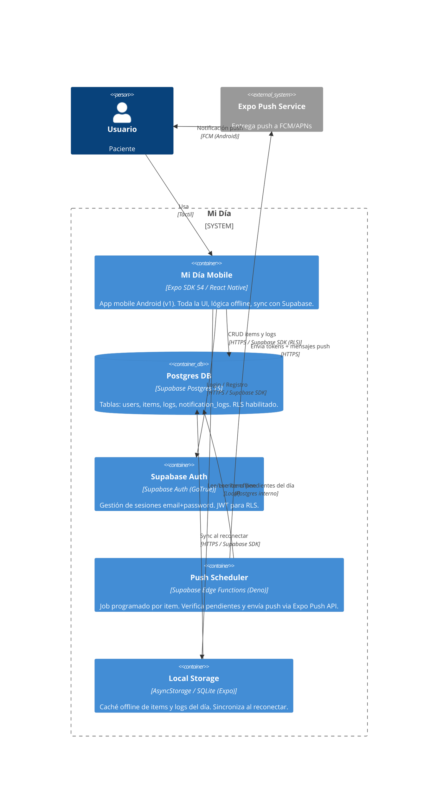

<!-- generated by /discovery-architecture -->
# C4 — Level 2: Containers

## Diagrama

## Tabla de contenedores

| Container | Tech | Propósito | Habla con |
|-----------|------|-----------|-----------|
| Mi Día Mobile | Expo SDK 54 / React Native | UI completa, offline-first, sync — **Android únicamente (v1)** | Supabase Auth, Postgres DB, Local Storage |
| Postgres DB | Supabase Postgres 15 | Persistencia de users, items, logs | — |
| Supabase Auth | GoTrue (Supabase) | Auth email+password, JWT para RLS | Postgres DB |
| Push Scheduler | Supabase Edge Functions (Deno) | Scheduler por item: dispara push a la hora configurada | Postgres DB, Expo Push Service |
| Local Storage | AsyncStorage / SQLite (Expo) | Operación offline del día actual | Postgres DB (sync) |

## Notas de diseño

- **RLS en todas las tablas**: cada query filtra automáticamente por `auth.uid()` — NFR-SEC-01.
- **Offline-first**: el mobile escribe primero en Local Storage; sincroniza en background — NFR-AVAIL-02.
- **Scheduler granularidad**: un job por item (no por bloque), se cancela si el item ya fue marcado antes de su hora — UC-05.
- **Plan gratuito**: Supabase free (500 MB DB, 2 GB bandwidth, 500K Edge Function invocations/mes) + Expo Push (gratuito) — NFR-SCALE-01.
- **Web (futuro)**: se agregará como un nuevo Container (Next.js en Vercel) que comparte el mismo Postgres DB y Auth.
