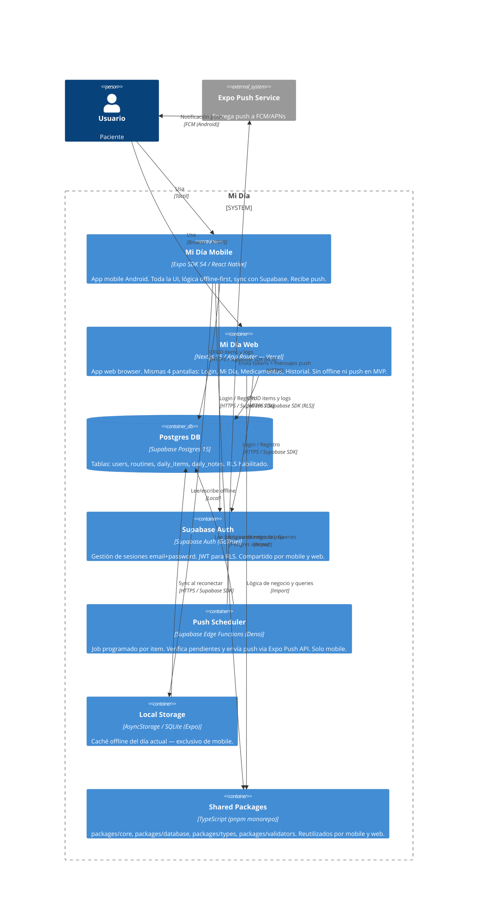

<!-- generated by /discovery-architecture -->
# C4 — Level 2: Containers

## Diagrama

## Tabla de contenedores

| Container | Tech | Propósito | Habla con |
|-----------|------|-----------|-----------|
| Mi Día Mobile | Expo SDK 54 / React Native | UI Android, offline-first, push — **Android únicamente** | Supabase Auth, Postgres DB, Local Storage, Shared Packages |
| Mi Día Web | Next.js 15 / App Router (Vercel) | UI web browser — Login, Mi Día, Medicamentos, Historial | Supabase Auth, Postgres DB, Shared Packages |
| Postgres DB | Supabase Postgres 15 | Persistencia de routines, daily_items, daily_notes | — |
| Supabase Auth | GoTrue (Supabase) | Auth email+password, JWT para RLS | Postgres DB |
| Push Scheduler | Supabase Edge Functions (Deno) | Dispara push a la hora configurada — solo mobile | Postgres DB, Expo Push Service |
| Local Storage | AsyncStorage / SQLite (Expo) | Operación offline del día actual — solo mobile | Postgres DB (sync) |
| Shared Packages | TypeScript monorepo | Lógica de negocio y acceso a datos reutilizable | — |

## Notas de diseño

- **RLS en todas las tablas**: cada query filtra automáticamente por `auth.uid()` — aplica igual a mobile y web.
- **Shared packages**: `packages/core` (lógica pura), `packages/database` (Supabase client), `packages/types`, `packages/validators` no tienen dependencias de React Native y se reutilizan sin cambios en `apps/web`.
- **Offline-first solo en mobile**: la web opera conectada. No hay sync local en MVP web.
- **Push solo en mobile**: el Push Scheduler solo envía tokens Expo (mobile). Web Push API fuera del MVP.
- **Mismo backend**: mobile y web comparten el mismo Supabase project — mismo Postgres, mismo Auth, misma RLS.
- **Styling independiente**: mobile usa NativeWind; web usa Tailwind CSS estándar (mismo sistema de tokens, distinta implementación).
- **Plan gratuito**: Supabase free + Expo Push (gratuito) + Vercel Hobby (gratuito para apps Next.js).
