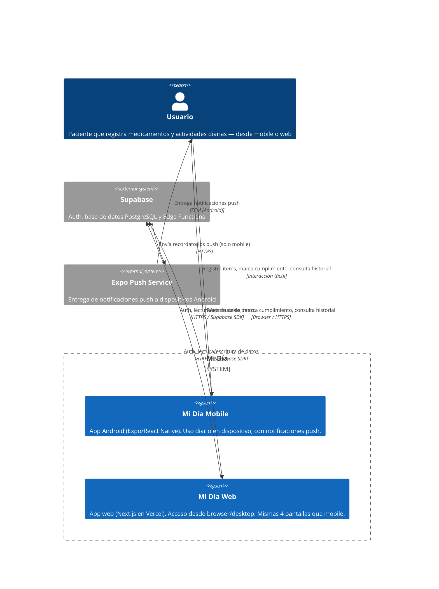

<!-- generated by /discovery-architecture -->
# C4 — Level 1: Context

## Diagrama

## Actores y sistemas

| Nombre | Tipo | Descripción |
|--------|------|-------------|
| Usuario | Persona | Paciente que gestiona su adherencia — puede usar mobile y/o web |
| Mi Día Mobile | Sistema | App Android Expo/React Native — offline-first, con push |
| Mi Día Web | Sistema | App web Next.js (Vercel) — mismas 4 pantallas, sin push en MVP |
| Supabase | Sistema externo | Auth (email+password), Postgres DB con RLS, Edge Functions para scheduler de push |
| Expo Push Service | Sistema externo | Entrega push a Android via FCM (solo aplica a mobile) |

## Fuera de alcance (Level 1)
- Administradores o usuarios secundarios (cuidadores)
- Integración con farmacias, recetas médicas o sistemas de salud externos
- Notificaciones push en web (Web Push API) — MVP web recibe push solo via mobile
