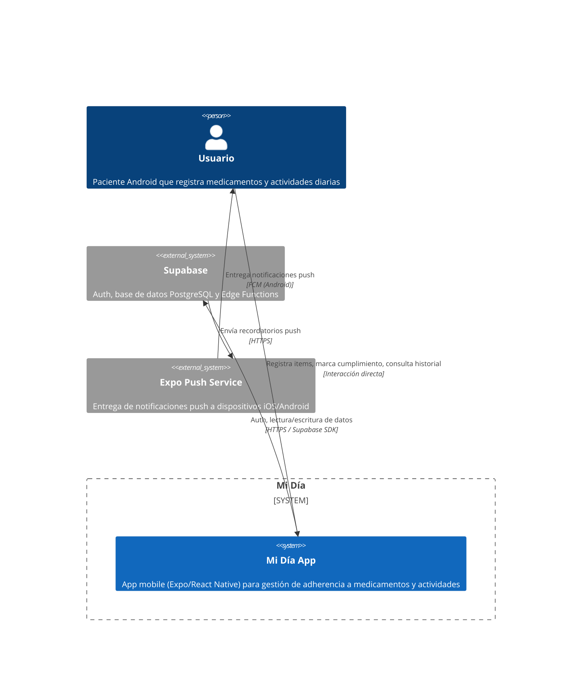

<!-- generated by /discovery-architecture -->
# C4 — Level 1: Context

## Diagrama

## Actores y sistemas

| Nombre | Tipo | Descripción |
|--------|------|-------------|
| Usuario | Persona | Paciente que usa la app mobile para gestionar su adherencia |
| Mi Día App | Sistema | App mobile Expo/React Native — el sistema principal |
| Supabase | Sistema externo | Auth (email+password), Postgres DB con RLS, Edge Functions para scheduler de push |
| Expo Push Service | Sistema externo | Intermediario para entrega de notificaciones push a iOS y Android (gratuito) |

## Fuera de alcance (Level 1)
- Versión web (planificada para una fase posterior)
- Administradores o usuarios secundarios (cuidadores)
- Integración con farmacias, recetas médicas o sistemas de salud externos
